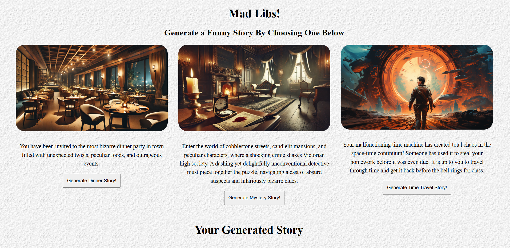

# Mad Libs

## What is Mad Libs

You might have played it before where it is a word game that consists of a player prompting others for a list of words to fill in the blanks of a story before reading it outloud. In this project you will be using functions to create stories and prompting users (yourself or others) to enter input based on the story. These inputs could be adjectives, nouns, verbs, vehicles, food items, etc.


## Part I: HTML
- In `index.HTML` create a div tag with class container
- Within that div tag create 3 other div tags with class category. These will represent your 3 different stories.
- Each of those div tags will have a ````, ``<p>``, and ``<button>`` tags inside of them.

- In one of the div tags:
    - Create a ```` tag and get `dinner.jpg` from the images folder.
    - (Optional) Set the alt to dinner.
    - Create a ``<p>`` tag and paste in the following:
    ```plaintext
    You have been invited to the most bizarre dinner party in town filled with unexpected twists, peculiar foods, and outrageous events.
    ```
    - Create a ``<button>`` tag and inside the tag paste in the following:
    ```plaintext
    Generate Dinner Story!
    ```
    - We want the button to do something when someone clicks on it so within the button tag, create an onclick event in which when the user clicks the button, it will run a function which will be implemented later, for now leave the onclick event blank. This is what it will look like:

    ```html
    <button onclick="">Generate Dinner Story</button>
    ```

- In another div tag:
    - Create an ```` tag and get the `mystery.jpg` from the images folder.
    - (Optional) Set the alt to mystery.
    - Create a ``<p>`` tag then copy and paste the following:
    ```plaintext
    Enter the world of cobblestone streets, candlelit mansions, and peculiar characters, where a shocking crime shakes Victorian high society. A dashing yet delightfully unconventional detective must piece together the puzzle, navigating a cast of absurd suspects and hilariously bizarre clues.
    ```
    - Create a ``<button>`` tag with an onclick event then copy and paste the following in the button tag:
    ```plaintext
    Generate Mystery Story!
    ```
- In the last div tag:
    - Do the same thing and get the `time_travel.jpg` from the images folder.
    - (Optional) Set the alt to travel.
    - Copy and paste the following:
    ```plaintext
    Your malfunctioning time machine has created total chaos in the space-time continuum! Someone has used it to steal your homework before it was even due. It is up to you to travel through time and get it back before the bell rings for class.
    ```
    - Create a ``<button>`` tag with onclick then copy and paste the following:
    ```plaintext
    Generate Time Travel Story!
    ```
- Outside the div tag with the class container create a ``<h3>`` tag and paste in the following:
```plaintext
Your Generated Story
```
- Lastly, outside of the div tag with class container, create a div tag with an id of output. You can leave it blank.


## Part II: CSS
- For now your website will look kind of funky with big images and text not aligning properly.
- In `style.css` we want the header's (the ``<h1>`` and ``<h2>`` tags) to be in the center of our website (Hint: Use Flexbox!).
- First off the images are way to big, we need to resize it.
- Style all images to have the following:
    - `width` of 100%
    - `height` set to auto. You can just type `auto`.
    - `border-radius` to about 25 pixels.
        - This will round the corners for images.
    - `margin-bottom` to about 10 pixels. 
        - This will help space between the images and text.

- Style all paragraphs ``<p>`` to have the following:
    - `font-size` of 16 pixels.
    - `line-height` of 1.5.

- Style all buttons ``<button>`` to have the following:
    - `padding` of 10 pixels.

### ---- Feel free to change any of the values or add additional styling elements! ----

- Alright now we need to style all elements in the container class.
```css
.container {
    /* Code goes here */
}
```
- Implement the following:
    - Use flexbox to put everything in the center and make it so that the "Your Generated Story" text is at the bottom instead of the side (HINT: Mess around with the `flex-wrap` and `justify-content` properties).
    - `gap` of about 30 pixels.

- Style the category class by:
    - Making the text center using `text-algin`.
    - Set the `width` to 30%.

- Finally style the output by calling it's id
```css
#output {
    /* Code goes here */
}
```
- Implement the following:
    - Make the text centered.
    - Set the `font-size` to 50 pixels.

After all that, your website should look similar to this:



## Part III: JavaScript
- In the `script.js` you will implement 3 functions that will be added to the onclick event in the `index.HTML` file.
- Create a function named `dinner` with no parameters.
- Inside the dinner function you will create variables that takes in user input by using the `prompt` method which looks something like this:
```js
const varName = prompt("Question goes here...");
```
- Create 8 variables that prompts the users to enter the following (in parentheses) from this story:
```plaintext
The dinner party started with a dish of (FOOD) that smelled like (SOMETHING STRANGE). 
Suddenly, a (ADJECTIVE) (ANIMAL) appeared and started (VERB) on the table! 
The host grabbed a (OBJECT) and yelled "(FUNNY QUOTE)!" 
We all laughed and said "(ANOTHER FUNNY QUOTE)." It was unforgettable!
```
- Here is an example of what your variables should look like:
```js
const food = prompt("Name a food item");
```
- Next we need to ensure that the user has inputted something in all of the 8 variables. We will use `if` and `else` statements.
- Here is the format of `if` and `else` statements in JavaScript:
```js
if (condition)
{
    // Run this part of code
}
else
{
    // Run this part instead
}
```
- Create a condition to check if the user inputted something for all 8 of the variables. You can do this by using the AND operator `&&`:
```js
if (condition1 && condition2 && ...) //<-- if condition 1 and condition 2 are true then run the code below otherwise run the code in the else statement.
{
    // Run this part of code
}
else
{
    // Run this part instead
}
```

        